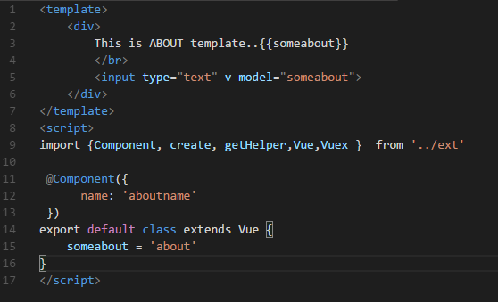

#  Vue2+ + TypeScript2+ example 
 All-in Corporate vue typescript template with single file component, hot reload, bootstrap 4,  webpack , express server, 
 boostrap vue 2 datetimepicker, multiselect with search,
 local storage, vuex , router, pre-compiled templates all out of the box!

 - fork based on [av-ts] (https://github.com/HerringtonDarkholme/av-ts), .vue single file component, also separate ts files demonstation 

------




For more information, please read this [article](https://herringtondarkholme.github.io/2016/10/03/vue2-ts2/)

### how to run template
```
npm install 

npm run dev
```

### how to update vue:

```
npm install vue 
```

typings support

For TypeScript 2.x, there are now two steps:

    Install a package that defines require. For example:
```
    npm install @types/node --save-dev
```
    Tell TypeScript to include it globally in tsconfig.json:
```
    {
        "compilerOptions": {
            "types": ["node"]
        }
    }
```
